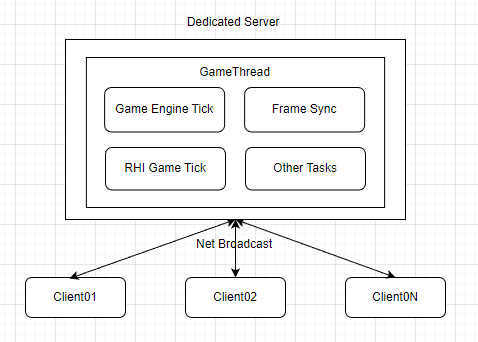

# Multiplayer Performance Analysis

## Dedicated Server Performance Factors

DS性能(No Render/RHI Thread, Just GameThread)主要受Cpu和Net等相关的性能因素影响, 其中CPU部分(GameThread)的主要性能影响在GameEngine的World Tick上, 如下所示:  

	GameThread 
	-- GameEngine Tick 
	   -- World Tick
	   -- TickableGameObjects Tick
	   -- TickAsyncLoading GT
	   -- Update Level Streaming
	   -- Conditional Commit Map Change
	   -- Tick World Travel
	   -- Get World Context From Handle Checked
	   -- Render Target Pool Transition Wait
	   -- ...
	-- Deferred Tick 
	-- Frame Sync 
	-- RHI Game Tick 
	-- FEngineLoop Update Time And Handle Max Tick Rate
	-- FEngineLoop Wait For Movie To Finish
	-- FEngineLoop Tick AutomationWorker
	-- FEngineLoop Flush ThreadLogs
	-- FEngineLoop Idle 
	-- DelaySceneRenderCompletion TaskWait
	-- Delete Resources 
	-- ...

其中World Tick的主要CPU耗时在Actor的Tick、Net Broadcast Tick、Net Tick等的Tick上，如下所示：  

	World Tick
	-- Actor Tick
	-- Net Broadcast Tick
	-- GT Tickable Tick
	-- Net Tick
	-- Queue Ticks
	-- Update Camera
	-- Nav Tick
	-- Sequence Tick
	-- GC Sweep
	-- Reset Async Trace
	-- ...

一般影响DS CPU性能的主要是DS上的AI、移动同步、网络同步、动画、物理等功能的运行, 对应到World Tick中的Tick、NetBroadcast Tick、Net Tick上, 不同的应用程序影响可能不一样, 要具体应用具体分析.  

## Virtual Space DS Performance

在VirtualSpace的应用场景中, 大量的玩家/参展人员同时进入展会, 观看展会内容，沉浸式互动交流等. 大型的虚拟展会一般会有上百上千的玩家存在, 同一个展会房间的玩家通常会被分配到同一个DS上, 大量的Character同步会严重消耗DS的CPU时间, 延长World Tick的执行时间, 降低服务端的运行帧率. 进一步影响玩家的参展体验.  

World Tick在该场景下的分布如下图所示:  

下面分任务具体分析性能.

### Actor/Component Tick

UE4 GameThread提供了TaskGraph和ThreadPool等方式来管理异步任务, Actor/Component的Tick主要是由TaskGroup来管理, 针对Tick任务, UE4提供了8个TickGroup(TG_PrePhysics/TG_StartPhysics/TG_DuringPhysics/TG_PostPhysics/TG_PostUpdateWork/TG_LastDemotable/TG_NewlySpawned), 各个TickGroup串行执行(同步/异步), 保证有序执行.  

开发者注册Actor Tick或者Component Tick任务时, 可以设置Tick的周期、指定TickFunction所在哪个TickGroup启动, 必须在哪个TickGroup执行完成.  

比如默认的Actor的TickGroup和EndTickGroup是TG_PrePhysics, 即TickFunction需要在Physics Simulation启动之前执行, 且执行完成.  

在VirutalSpace应用场景下, 在Physics Simulation启动之前需要执行完成Character、PlayerController、GameMode等Actor TickFunction, 以及MovementComponent、CharacterMeshComponent等Actor Compnent的Tick Function.  

#### Player/Character TickFunction

TickFunction主要执行在Character中自定义Tick逻辑和注册的Event, 开发者可以选择使用C++或者蓝图实现, 如下图Charater的蓝图实现所示, TickFunction主要执行ExecuteUbergraph, 性能消耗主要在蓝图的调用执行.  

注:蓝图的性能远远低于C++, 在Character非常多的情况(1K+), 一个小小的逻辑判断如KismetMathLibrary.BooleanAND的耗时都可达1.6ms, 整个UberGraph的执行调用甚至长达11ms.  

#### CharMoveComp TickFunction

TickFunction主要在执行PhysWalking, 其中大部分耗时都在SceneQuery计算上, 比如GeomWeep和Raycast计算逻辑(FindFloor、EndScoped MovementUpdate、RootMotionSource Apply、AdjustFloorHeight).  

比如耗时最长的FindFloor的GeomSweep计算包括ComputeFloorDist(ConvertQueryHit、SetHitResultFromShapeAndFaceIndex、PhysX Scene ReadLock), 在千人场景下耗时长达可达18ms.  

#### CharacterMesh TickFunction

TickFunction主要是SkinnedMeshComp Tick逻辑, 如Update Animation的计算, 一般服务器端可以开启动画更新优化开关(OnlyTickMontagesWhenNotRendered), 开启动画更新频率优化URO开关, 防止动画更新过于频繁.  

#### Character SpringArmComponent TickFunction

TickFunction主要是Camera的Update Transform逻辑, 执行UpdateComponentToWorld、CalcBounds的计算.  

### Net Broadcast Tick

Net Broadcast Tick主要完成Actor的Replication, 可以说UE的Multiplayer主要功能都在Net Broadcast Tick里面实现, 千人/万人同世界的场景下, 这个部分也是性能影响最大瓶颈点.  

UE4的ActorReplication原理如下图所示:  

