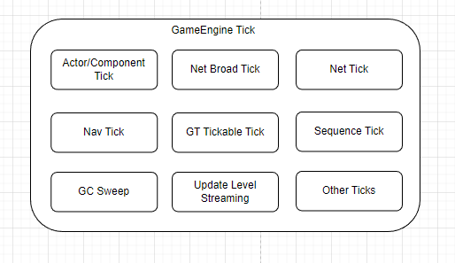
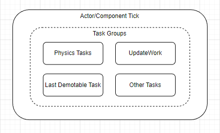
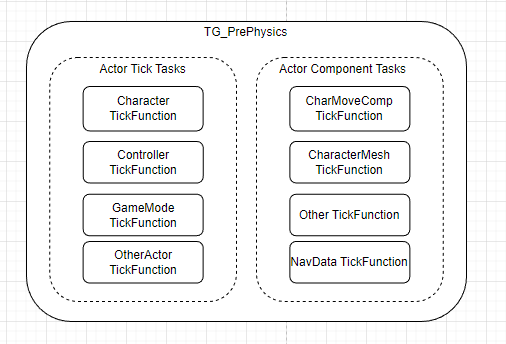
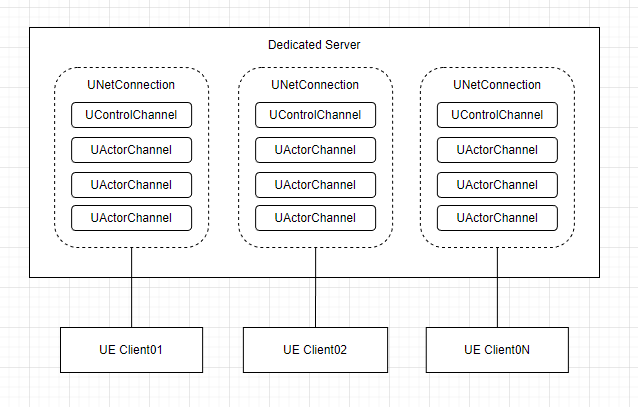
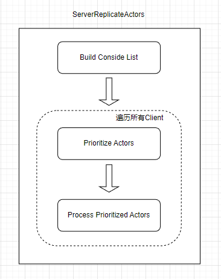
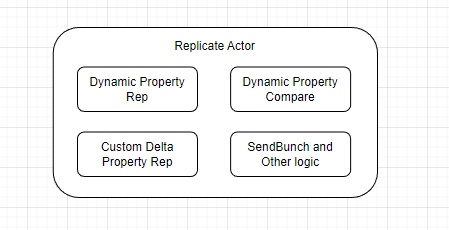

# Multiplayer Performance Analysis

# Dedicated Server Performance Factors

DS性能(No Render/RHI Thread, Just GameThread)主要受Cpu和Net等相关的性能因素影响, 其中CPU部分(GameThread)的主要性能影响在GameEngine的World Tick上, 如下所示:  

其中World Tick的主要CPU耗时在Actor的Tick、Net Broadcast Tick、Net Tick等的Tick上，如下所示：  

一般影响DS CPU性能的主要是DS上的AI、移动同步、网络同步、动画、物理等功能的运行, 对应到World Tick中的Tick、NetBroadcast Tick、Net Tick上, 不同的应用程序影响可能不一样, 要具体应用具体分析.  

# Virtual Space DS Performance Analysis

在VirtualSpace的应用场景中, 大量的玩家/参展人员同时进入展会, 观看展会内容，沉浸式互动交流等. 大型的虚拟展会一般会有上百上千的玩家存在, 同一个展会房间的玩家通常会被分配到同一个DS上, 大量的Character同步会严重消耗DS的CPU时间, 延长World Tick的执行时间, 降低服务端的运行帧率. 进一步影响玩家的参展体验.  

World Tick在该场景下的分布如下图所示:  

下面分任务具体分析性能.  

## Actor/Component Tick

UE4 GameThread提供了TaskGraph和ThreadPool等方式来管理异步任务, Actor/Component的Tick主要是由TaskGroup来管理, 针对Tick任务, UE4提供了8个TickGroup(TG_PrePhysics/TG_StartPhysics/TG_DuringPhysics/TG_PostPhysics/TG_PostUpdateWork/TG_LastDemotable/TG_NewlySpawned), 各个TickGroup串行执行(同步/异步), 保证有序执行.  

开发者注册Actor Tick或者Component Tick任务时, 可以设置Tick的周期、指定TickFunction所在哪个TickGroup启动, 必须在哪个TickGroup执行完成.  

比如默认的Actor的TickGroup和EndTickGroup是TG_PrePhysics, 即TickFunction需要在Physics Simulation启动之前执行, 且执行完成.  

在VirutalSpace应用场景下, 在Physics Simulation启动之前需要执行完成Character、PlayerController、GameMode等Actor TickFunction, 以及MovementComponent、CharacterMeshComponent等Actor Compnent的Tick Function.  

### Player/Character TickFunction

TickFunction主要执行在Character中自定义Tick逻辑和注册的Event, 开发者可以选择使用C++或者蓝图实现, 如下图Charater的蓝图实现所示, TickFunction主要执行ExecuteUbergraph, 性能消耗主要在蓝图的调用执行.  

注:蓝图的性能远远低于C++, 在Character非常多的情况(1K+), 一个小小的逻辑判断如KismetMathLibrary.BooleanAND的耗时都可达1.6ms, 整个UberGraph的执行调用甚至长达11ms.  

### CharMoveComp TickFunction

TickFunction主要在执行PhysWalking, 其中大部分耗时都在SceneQuery计算上, 比如GeomWeep和Raycast计算逻辑(FindFloor、EndScoped MovementUpdate、RootMotionSource Apply、AdjustFloorHeight).  

比如耗时最长的FindFloor的GeomSweep计算包括ComputeFloorDist(ConvertQueryHit、SetHitResultFromShapeAndFaceIndex、PhysX Scene ReadLock), 在千人场景下耗时长达可达18ms.  

### CharacterMesh TickFunction

TickFunction主要是SkinnedMeshComp Tick逻辑, 如Update Animation的计算, 一般服务器端可以开启动画更新优化开关(OnlyTickMontagesWhenNotRendered), 开启动画更新频率优化URO开关, 防止动画更新过于频繁.  

### Character SpringArmComponent TickFunction

TickFunction主要是Camera的Update Transform逻辑, 执行UpdateComponentToWorld、CalcBounds的计算.  

## Net Broadcast Tick

Net Broadcast Tick主要完成Actor的Replication, 可以说UE的Multiplayer主要功能都在Net Broadcast Tick里面实现, 千人/万人同世界的场景下, 这个部分也是性能影响最大瓶颈点.  

UE4的ActorReplication原理如下图所示:  

每个客户端与DS建立一个UNetConnection连接, 对于每一个连接, DS会周期性遍历所有Actor, 调用IsNetRelevantFor()方法判断这个Actor是否与这个客户端相关, 如果相关(Actor需要同步给这个Client), DS就会在对应这个客户端的连接中添加这个Actor的Channel, 每个Tick周期内, 执行Actor的属性需要同步.  

VirutalSpace场景下, 除了常规的Actor需要同步外, 参展的人(Character)是最主要的同步对象(Actor), Client数以及需要同步的Actor数量直接影响了DS的性能, 可以看出这块的性能影响是O(n2).  

举个例子, 1K人参加一个小展会(2K平米), 默认网络剔除距离为150米, 单个DS上需要建立1K个链接, 每个链接上至少需要创建1K个ActorChannel, DS每一帧需要同步100万(1K*1K)个Actor属性, DS需要周期性的计算这些Actor的相关性(距离), 计算Actor的属性差异(位置/朝向等), 排序/封装NetConnection中的ActorChannel列表, 执行同步(序列化等).  

### ServerReplicateActors

Net Broadcast Tick中最主要的任务是执行ServerReplicateActors, 执行Actor到client connection的Replication.  

其中计算最耗时的部分是Process Prioritized Actors, 对于每一个client链接上的每一个ActorChannel, 执行Channel->ReplicateActor().  

# VirtualSpace Thousand Players Test Result

注: 当Actor数量非常多时, 开启Profile功能会严重消耗DS的CPU资源, 导致帧率严重下降, 获得的GameThread Profile耗时数据严重偏大, 虽然无法精确获得实际耗时, 但可以帮助我们分析系统目前哪一部分耗时相对更长, 是系统的瓶颈点/可优化点.  

	1. DS最主要的CPU资源消耗在执行GameEngine Tick上, 其中Net Broadcast Tick和Actor/Actor Component Tick是最主要的耗时任务, 占总耗时的95+%.

	2. Actor/Actor Component Tick的耗时与Character和关联的Component的数量相关.

	3. 每个Character/Component Tick耗时主要在CharMoveComp、Character、MeshComponent以及SpringArmComponent的tick上, 主要是PhysWalking的SceneQuery、开发者自定义的蓝图执行、蒙太奇动画更新、Camera的Transform, 在当前测试场景下这几个组件的Tick耗时比为4:2:1:1.

	4. Net Broadcast的CPU耗时与客户端数量以及服务端上的Channels数量相关.

	5. Net Broadcast Tick耗时主要在ReplicateActor上, 主要是每个客户端链接中的每个ActorChannel上执行排序、计算相关性、Replicate、序列化等.

	6. 随客户端的增加, Net Broadcast Tick与Actor/ActorComponent Tick耗时比例逐步增加(1Client/1K Character下是1:4, 30Client/1K Character下是5:2).

# Developer Optimize Advise

	1. 服务器上关闭不必要的Component Tick.

	2. 服务器上开启动画更新优化开关(OnlyTickMontagesWhenNotRendered), 仅同步蒙太奇.

	3. 优化FindFloor实现, 减少GeomSweep耗时.

	4. 玩家Tick/Event实现改为C++实现(蓝图->C++).
	

# Performance Further Improvement

## 1. World Partition(TODO)

大世界场景下, 为了提升性能, 可以将世界分区(Spatial Partition), Actor按需加载. 在VirtualSpace场景下UE5里面的WorldPartition技术不是很适用, 可以考虑类似AWS SimSpace的做法, 通过分布式的DS实现世界分区, 每个DS按需处理所属分区的应用逻辑, 从而提升整体性能.  

## 2. Distribute Client Connections

通过Distrubuted DS实现Client Connections的Distribution, 将Net Boradcast分布式到多个DS, 减少单个DS需要处理的ActorChannel数量, 从而提升整体性能.  

### 2.1 DS Distribute

AussSDK和AussService针对3D应用程序提供高性能的数据复制、状态同步、Spatial Partitioning等功能, 开发者基于这些能力可以实现Pawn Synchronization、Actor Replication、RPC等Multiplayer功能, 帮助开发者实现DS Distribute.  

### 2.2 VirtualSpace Performance Optimization

基于DS Distribute的方案, 除了上一章节列出的优化建议外, 进一步的优化建议如下:  

	1. 优化NetBroadcast耗时, 去除远端玩家不需要的Component, 或者关闭该Component在服务端的Tick, 比如SpringArmComponent等.

	2. 优化NetBroadcast耗时, 关闭远端玩家的移动同步, 直接通过RPC同步输入给客户端, 客户端模拟移动, 减少服务端的遍历属性耗时.

	3. 使用ReplicationGraph功能, 设置好远端玩家和本地玩家的同步分组和地图分区, 优化服务端计算相关性耗时.

	4. 合理设定玩家的网络剔除距离, 必要时优化相关性函数实现, 提升游戏体验. 

